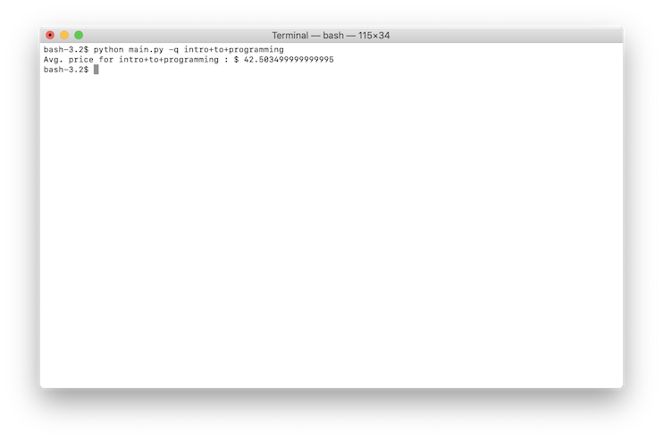

# web-scraper
> A Web Scraping API for BarterOut Future Projects

### Motivation.

> Since Barnes and Noble, along with many other textbook retailers don't have API's, we needed to create web scraping tools to do this work for us.

### Tools Used
- Python 3.6.4
- BeautifulSoup4
- Requests

### To Run the Project
- Make sure to:
  1. `pip3 install requests`
  2. `pip3 install beautifulsoup4`
- then run `python main.py -q query`

_*note that queries should not contain spaces, just + signs_

## Documentation
Currently, if you run `python main.py -q your_query`, it will return the average book price for the search results from Barnes and Noble on one page. The default query is `calculus+for+dummies`.

These results may be inaccurate, or, the program may just crash. It is still in the very early stages of dev.

### Example Query:

### Future Methods:
- Specify site
- Specify Query
- Specify function (what reseults it returns)
- Specify data return format (JSON, etc.)
- Anything you can dream of...

